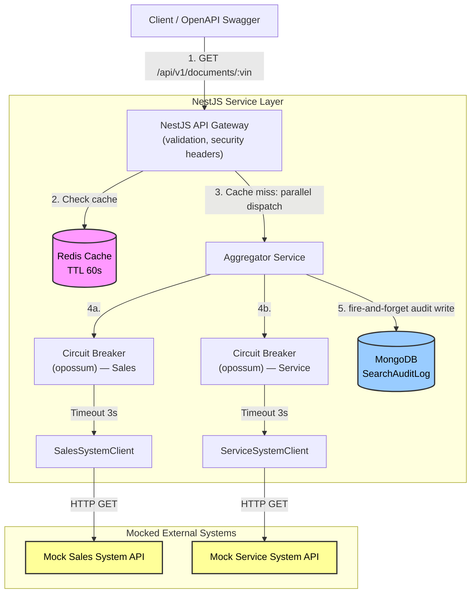
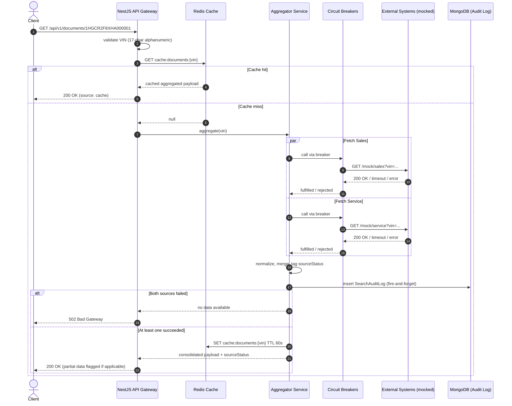

# System Design Document: Unified Document Viewer (Scenario D)

**Role:** Engineering Team Lead
**Domain:** Operate
**Target Solution:** A resilient backend service that aggregates vehicle document metadata across two legacy dealership platforms, with persistent audit logging and a pragmatic, honestly-scoped security posture.

> **Scope note**: This document distinguishes between what is **implemented in this
> submission** and what is **documented as a production consideration but out of scope**
> for a one-week exercise. This separation is intentional — see Section 6.

---

## 1. Architecture Diagram

---

## 2. Component Descriptions

| Component | Role |
|---|---|
| **NestJS API Gateway** | Exposes `GET /api/v1/documents/:vin`, validates input via `class-validator` DTOs, applies security headers (Helmet), returns the OpenAPI/Swagger contract. |
| **Aggregator Service** | Orchestrates cache lookup, parallel downstream fan-out, response normalization, and the audit-log write. |
| **Circuit Breakers (opossum)** | Independently monitor each downstream (Sales, Service) based on the client's success/failure outcome; trip after repeated failures to fail fast rather than cascade latency. Timeout enforcement itself lives in the HTTP client, not the breaker, to avoid two competing timeout sources. |
| **SalesSystemClient / ServiceSystemClient** | Thin HTTP clients per external system, each with its own timeout (3s). |
| **Redis Cache** | In-memory cache of the aggregated response per VIN, short TTL, reduces load on mocked downstreams and serves as a fast path on repeat lookups. |
| **MongoDB — `SearchAuditLog`** | **Persistent database** required by the challenge. Stores one record per search: which VIN was queried, when, and whether each source succeeded or failed. This is the system's durable data — Redis is explicitly a cache, not the persistence layer. |
| **Mocked Sales/Service APIs** | Simulated external systems, independently controllable (inject latency/error) to demonstrate resilience behavior in the video walkthrough. |

---

## 3. Data Flow

**Key detail on persistence**: the audit-log write to MongoDB is deliberately
**fire-and-forget** (not awaited before responding) — it must never add latency to the
critical read path or become a point of failure for the user-facing request. Failures to
write the audit log are logged but never surfaced to the client.

---

## 4. Tech Stack & Justifications

| Technology | Selection | Justification |
|---|---|---|
| **Core Framework** | NestJS (TypeScript) | Dependency injection and modular structure map cleanly onto controller / aggregator / client boundaries. |
| **Persistent Database** | **MongoDB (Mongoose)** | Fulfils the challenge's explicit "use a persistent database" requirement. Chosen over a relational DB because the audit-log schema (VIN, timestamp, per-source status, latency) is simple, document-shaped, and doesn't need relational joins. Also reuses prior hands-on Mongo/Mongoose experience. |
| **Cache** | Redis | Explicitly a **cache**, not the system of record — reduces load on mocked downstreams and speeds up repeat lookups. Kept separate from MongoDB to keep each store's responsibility unambiguous. |
| **Resilience** | opossum (circuit breaker) | Mature, event-driven circuit breaker; prevents one degraded downstream from starving the whole request path. |
| **Concurrency** | `Promise.allSettled` (native) | One source failing must never fail the aggregate response — this is the core resilience requirement of the scenario. |
| **Validation** | class-validator / class-transformer | Declarative DTO validation, e.g. `@IsAlphanumeric()` + `@Length(17,17)` on VIN. |
| **Logging** | Pino (`nestjs-pino`) | Low-overhead structured JSON logging, easy to correlate via `correlationId`. |
| **Telemetry** | OpenTelemetry SDK (basic) | Vendor-neutral tracing; sufficient to produce request/child spans for this exercise, exported to console. |
| **Security headers** | Helmet | Standard NestJS middleware for baseline HTTP security headers — actually implemented, low effort, no scope risk. |
| **Testing** | Jest (unit) + Playwright (API integration) | Jest isolates aggregation/merge logic; Playwright exercises the real HTTP contract end-to-end. |
| **API docs** | `@nestjs/swagger` | Auto-generated OpenAPI contract, doubling as the "basic API contract" deliverable for the unimplemented frontend layer. |
| **Containerization** | Docker Compose (Redis + MongoDB) | One-command reproducible environment for reviewers. |

---

## 5. Observability Strategy

- **Structured logging**: every request gets a `correlationId` (from inbound header or
  generated), propagated through the aggregator and both external clients, so a single
  request's full execution can be reconstructed from logs.
- **Per-source metrics in logs**: `{ correlationId, source, vin, latencyMs, outcome }` per
  downstream call.
- **Tracing**: a root span per request with two child spans (`sales-system-call`,
  `service-system-call`) via OpenTelemetry, exported to console for this exercise.
- **Circuit breaker state**: opossum state transitions (closed → open → half-open) are logged.
- **Persistent audit trail**: unlike logs (ephemeral, rotated), `SearchAuditLog` in MongoDB
  gives a queryable historical record — e.g. "which VINs are searched most", "which source
  system fails most often" — genuinely useful operational data, not persistence added just to
  satisfy a checkbox.

---

## 6. Security Posture

To keep this section honest about what's actually implemented in a one-week individual
exercise versus what a production system would require, it is split into two parts.

### 6.1 Implemented in this submission

| Concern | Mitigation |
|---|---|
| **Injection (OWASP A03)** | Strict input validation — `vin` is required, alphanumeric, exactly 17 characters, enforced via DTO + `class-validator` at the controller boundary before any business logic runs. |
| **Insecure design / cascading failure (OWASP A04)** | `Promise.allSettled` + circuit breakers isolate downstream failures; one failing/compromised vendor API cannot degrade the whole service or exhaust connections. |
| **Security misconfiguration (OWASP A05)** | Helmet middleware sets standard secure headers (CSP, HSTS, etc.) on all API routes. CSP and HSTS are explicitly relaxed only for the `/api/docs` (Swagger UI) route via route-scoped middleware — Swagger's bundled assets require inline scripts/styles that a strict CSP blocks, and HSTS is disabled in the local/dev config since the app runs over plain HTTP (would be re-enabled in production behind TLS termination). This is a scoped, documented exception, not a blanket disable. CORS is restricted to explicit allowed origins in config. |
| **Data integrity (OWASP A08)** | Responses from external systems are mapped into a strict, predefined DTO/schema before being cached or returned — no raw passthrough of unmapped external data. |
| **SSRF (OWASP A10)** | Downstream URLs are statically configured server-side; the client only ever supplies a `vin` string, never a URL or host — there is no code path where user input influences an outbound request target. |
| **Secrets handling** | Config (Redis/Mongo connection strings) loaded via `@nestjs/config` from environment variables; nothing sensitive committed to the repo. `.env.example` provided, real `.env` gitignored. |

### 6.2 Documented as production considerations (explicitly out of scope here)

These are real concerns for a production Keyloop deployment, but are **not implemented** in
this submission — called out here to be transparent rather than implying they exist in the code:

| Concern | Production approach (not built) |
|---|---|
| **AuthN/AuthZ (A01, A07)** | JWT validation against a real IdP + RBAC guard scoping access to a dealer's own VINs. This exercise has no auth layer — the API is open, matching the challenge's "mocked systems" framing. |
| **Edge protection** | A managed WAF/rate-limiter (e.g., Cloudflare) in front of the API gateway. Not applicable to a local/exercise deployment. |
| **TLS termination** | Real deployments would terminate TLS 1.3 at the load balancer; this exercise runs over plain HTTP locally. |
| **Dependency scanning (A06)** | `npm audit` / Snyk in CI. Not set up as a pipeline for this exercise, though it's a one-line addition worth mentioning as a next step. |
| **Centralized security monitoring (A09)** | Structured logs here are a foundation for this, but no actual alerting pipeline (Datadog/ELK) is wired up. |

This split is deliberate: overstating security implementation that doesn't exist in the code
would misrepresent the submission and would not survive a follow-up technical interview
question like "walk me through the AuthGuard."

---

## 7. System Assumptions

- **VIN format**: enforced as a 17-character alphanumeric string; requests violating this are
  rejected with `400` at the gateway layer before touching business logic. Full VIN checksum
  validation is out of scope.
- **Downstream SLA**: each mocked external call has a **3000ms** timeout; exceeding it is
  treated as a failure for that source (not a hang).
- **VIN not found on either system**: returns `404`, distinct from both-sources-failed
  (`502`) — "confirmed no data" is a different condition from "couldn't determine."
- **Partial availability**: if exactly one source responds, the API returns `200` with the
  available documents plus `sourceStatus` metadata flagging the failed source — never silently
  drops the failure.
- **Cache TTL**: 60 seconds — short enough to avoid stale results, long enough to absorb
  repeated lookups of the same VIN in a short window.
- **Audit log is best-effort**: a MongoDB write failure for the audit log is logged but never
  fails or delays the client-facing response — audit logging must not become a new point of
  failure for the core feature.
- **No frontend built**: per the challenge's "choose one layer" structure, backend was
  chosen as the fully-implemented layer; the frontend/client layer is represented via the
  auto-generated OpenAPI/Swagger contract.

---

## 8. GenAI in the Design Phase

Generative AI (Claude and Grok) was used as an active design collaborator to widen the
option space and stress-test decisions — final architectural calls, and the decision to keep
this document honest about implemented-vs-not, were made directly:

- **Rejected proposal — full Next.js frontend + monorepo**: proposed by one AI as part of a
  broader stack. Rejected because the challenge explicitly only requires one fully-implemented
  layer; a second full application and monorepo tooling would be disproportionate scope for a
  one-week, single-layer deliverable.
- **Rejected proposal — BullMQ for request queuing**: proposed to queue incoming lookups.
  Rejected because this is a synchronous read-and-aggregate use case — a queue adds latency
  and operational complexity with no corresponding benefit here.
- **Caught gap — missing persistent database**: an earlier draft of this design (produced
  with AI assistance) included Redis as the only data store. On review, this was identified as
  **not satisfying the challenge's explicit requirement** to "use a persistent database" —
  Redis is a cache, not a system of record. This revision adds MongoDB as the actual
  persistence layer (`SearchAuditLog`), chosen to be genuinely useful (operational visibility)
  rather than a token addition to satisfy a checklist item.
- **Affirmed pattern**: `Promise.allSettled` + per-source circuit breakers, validated as the
  correct approach across both AI reviews and applied deliberately, with the reasoning
  understood rather than the pattern copied blindly.

See `AI_NOTES.md` for the full, ongoing log of AI-assisted decisions carried into the
implementation phase.
